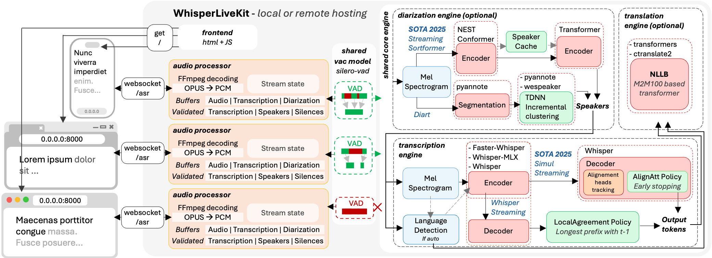

<h1 align="center">WhisperLiveKit</h1>

<p align="center">

</p>

<p align="center"><b>Real-time, Fully Local Speech-to-Text with Speaker Diarization</b></p>

<p align="center">
<a href="https://pypi.org/project/whisperlivekit/"></a>
<a href="https://pepy.tech/project/whisperlivekit"></a>
<a href="https://pypi.org/project/whisperlivekit/"></a>
<a href="https://github.com/QuentinFuxa/WhisperLiveKit/blob/main/LICENSE"></a>
</p>


WhisperLiveKit brings real-time speech transcription directly to your browser, with a ready-to-use backend+server and a simple frontend. ✨

Built on [SimulStreaming](https://github.com/ufal/SimulStreaming) (SOTA 2025) and [WhisperStreaming](https://github.com/ufal/whisper_streaming) (SOTA 2023) for transcription, plus [Streaming Sortformer](https://arxiv.org/abs/2507.18446) (SOTA 2025) and [Diart](https://github.com/juanmc2005/diart) (SOTA 2021) for diarization.


### Key Features

- **Real-time Transcription** - Locally (or on-prem) convert speech to text instantly as you speak
- **Speaker Diarization** - Identify different speakers in real-time. (⚠️ backend Streaming Sortformer in developement)
- **Multi-User Support** - Handle multiple users simultaneously with a single backend/server
- **Automatic Silence Chunking** – Automatically chunks when no audio is detected to limit buffer size
- **Confidence Validation** – Immediately validate high-confidence tokens for faster inference (WhisperStreaming only)
- **Buffering Preview** – Displays unvalidated transcription segments (not compatible with SimulStreaming yet)
- **Punctuation-Based Speaker Splitting [BETA]** - Align speaker changes with natural sentence boundaries for more readable transcripts
- **SimulStreaming Backend** - [Dual-licensed](https://github.com/ufal/SimulStreaming#-licence-and-contributions) - Ultra-low latency transcription using SOTA AlignAtt policy. 

### Architecture




## Quick Start

```bash
# Install the package
pip install whisperlivekit

# Start the transcription server
whisperlivekit-server --model tiny.en

# Open your browser at http://localhost:8000 to see the interface.
# Use  -ssl-certfile public.crt --ssl-keyfile private.key parameters to use SSL
```

That's it! Start speaking and watch your words appear on screen.

## Installation

```bash
#Install from PyPI (Recommended)
pip install whisperlivekit

#Install from Source
git clone https://github.com/QuentinFuxa/WhisperLiveKit
cd WhisperLiveKit
pip install -e .
```

### FFmpeg Dependency

```bash
# Ubuntu/Debian
sudo apt install ffmpeg

# macOS
brew install ffmpeg

# Windows
# Download from https://ffmpeg.org/download.html and add to PATH
```

### Optional Dependencies

```bash
# Sentence-based buffer trimming
pip install mosestokenizer wtpsplit
pip install tokenize_uk  # If you work with Ukrainian text

# Speaker diarization
pip install diart

# Alternative Whisper backends (default is faster-whisper)
pip install whisperlivekit[whisper]              # Original Whisper
pip install whisperlivekit[whisper-timestamped]  # Improved timestamps
pip install whisperlivekit[mlx-whisper]          # Apple Silicon optimization
pip install whisperlivekit[openai]               # OpenAI API
```

### 🎹 Pyannote Models Setup

For diarization, you need access to pyannote.audio models:

1. [Accept user conditions](https://huggingface.co/pyannote/segmentation) for the `pyannote/segmentation` model
2. [Accept user conditions](https://huggingface.co/pyannote/segmentation-3.0) for the `pyannote/segmentation-3.0` model
3. [Accept user conditions](https://huggingface.co/pyannote/embedding) for the `pyannote/embedding` model
4. Login with HuggingFace:
```bash
pip install huggingface_hub
huggingface-cli login
```

## 💻 Usage Examples

### Command-line Interface

Start the transcription server with various options:

```bash
# Basic server with English model
whisperlivekit-server --model tiny.en

# Advanced configuration with diarization
whisperlivekit-server --host 0.0.0.0 --port 8000 --model medium --diarization --language auto

# SimulStreaming backend for ultra-low latency
whisperlivekit-server --backend simulstreaming --model large-v3 --frame-threshold 20
```


### Python API Integration (Backend)
Check [basic_server.py](https://github.com/QuentinFuxa/WhisperLiveKit/blob/main/whisperlivekit/basic_server.py) for a complete example.

```python
from whisperlivekit import TranscriptionEngine, AudioProcessor, parse_args
from fastapi import FastAPI, WebSocket, WebSocketDisconnect
from fastapi.responses import HTMLResponse
from contextlib import asynccontextmanager
import asyncio

transcription_engine = None

@asynccontextmanager
async def lifespan(app: FastAPI):
    global transcription_engine
    transcription_engine = TranscriptionEngine(model="medium", diarization=True, lan="en")
    # You can also load from command-line arguments using parse_args()
    # args = parse_args()
    # transcription_engine = TranscriptionEngine(**vars(args))
    yield

app = FastAPI(lifespan=lifespan)

# Process WebSocket connections
async def handle_websocket_results(websocket: WebSocket, results_generator):
    async for response in results_generator:
        await websocket.send_json(response)
    await websocket.send_json({"type": "ready_to_stop"})

@app.websocket("/asr")
async def websocket_endpoint(websocket: WebSocket):
    global transcription_engine

    # Create a new AudioProcessor for each connection, passing the shared engine
    audio_processor = AudioProcessor(transcription_engine=transcription_engine)    
    results_generator = await audio_processor.create_tasks()
    results_task = asyncio.create_task(handle_websocket_results(websocket, results_generator))
    await websocket.accept()
    while True:
        message = await websocket.receive_bytes()
        await audio_processor.process_audio(message)        
```

### Frontend Implementation

The package includes a simple HTML/JavaScript implementation that you can adapt for your project. You can find it [here](https://github.com/QuentinFuxa/WhisperLiveKit/blob/main/whisperlivekit/web/live_transcription.html), or load its content using `get_web_interface_html()` :

```python
from whisperlivekit import get_web_interface_html
html_content = get_web_interface_html()
```

## ⚙️ Configuration Reference

WhisperLiveKit offers extensive configuration options:

| Parameter | Description | Default |
|-----------|-------------|---------|
| `--host` | Server host address | `localhost` |
| `--port` | Server port | `8000` |
| `--model` | Whisper model size. Caution : '.en' models do not work with Simulstreaming | `tiny` |
| `--language` | Source language code or `auto` | `en` |
| `--task` | `transcribe` or `translate` | `transcribe` |
| `--backend` | Processing backend | `faster-whisper` |
| `--diarization` | Enable speaker identification | `False` |
| `--punctuation-split` | Use punctuation to improve speaker boundaries | `True` |
| `--confidence-validation` | Use confidence scores for faster validation | `False` |
| `--min-chunk-size` | Minimum audio chunk size (seconds) | `1.0` |
| `--vac` | Use Voice Activity Controller | `True` |
| `--no-vad` | Disable Voice Activity Detection | `False` |
| `--buffer_trimming` | Buffer trimming strategy (`sentence` or `segment`) | `segment` |
| `--warmup-file` | Audio file path for model warmup | `jfk.wav` |
| `--ssl-certfile` | Path to the SSL certificate file (for HTTPS support) | `None` |
| `--ssl-keyfile` | Path to the SSL private key file (for HTTPS support) | `None` |
| `--segmentation-model` | Hugging Face model ID for pyannote.audio segmentation model. [Available models](https://github.com/juanmc2005/diart/tree/main?tab=readme-ov-file#pre-trained-models) | `pyannote/segmentation-3.0` |
| `--embedding-model` | Hugging Face model ID for pyannote.audio embedding model. [Available models](https://github.com/juanmc2005/diart/tree/main?tab=readme-ov-file#pre-trained-models) | `speechbrain/spkrec-ecapa-voxceleb` |

**SimulStreaming-specific Options:**

| Parameter | Description | Default |
|-----------|-------------|---------|
| `--frame-threshold` | AlignAtt frame threshold (lower = faster, higher = more accurate) | `25` |
| `--beams` | Number of beams for beam search (1 = greedy decoding) | `1` |
| `--decoder` | Force decoder type (`beam` or `greedy`) | `auto` |
| `--audio-max-len` | Maximum audio buffer length (seconds) | `30.0` |
| `--audio-min-len` | Minimum audio length to process (seconds) | `0.0` |
| `--cif-ckpt-path` | Path to CIF model for word boundary detection | `None` |
| `--never-fire` | Never truncate incomplete words | `False` |
| `--init-prompt` | Initial prompt for the model | `None` |
| `--static-init-prompt` | Static prompt that doesn't scroll | `None` |
| `--max-context-tokens` | Maximum context tokens | `None` |
| `--model-path` | Direct path to .pt model file. Download it if not found | `./base.pt` |
| `--preloaded-model-count` | Optional. Number of models to preload in memory to speed up loading (set up to the expected number of concurrent users) | `1` |

## 🔧 How It Works

1. **Audio Capture**: Browser's MediaRecorder API captures audio in webm/opus format
2. **Streaming**: Audio chunks are sent to the server via WebSocket
3. **Processing**: Server decodes audio with FFmpeg and streams into the model for transcription
4. **Real-time Output**: Partial transcriptions appear immediately in light gray (the 'aperçu') and finalized text appears in normal color

## 🚀 Deployment Guide

To deploy WhisperLiveKit in production:

1. **Server Setup** (Backend):
   ```bash
   # Install production ASGI server
   pip install uvicorn gunicorn

   # Launch with multiple workers
   gunicorn -k uvicorn.workers.UvicornWorker -w 4 your_app:app
   ```

2. **Frontend Integration**:
   - Host your customized version of the example HTML/JS in your web application
   - Ensure WebSocket connection points to your server's address

3. **Nginx Configuration** (recommended for production):
    ```nginx    
   server {
       listen 80;
       server_name your-domain.com;

    location / {
        proxy_pass http://localhost:8000;
        proxy_set_header Upgrade $http_upgrade;
        proxy_set_header Connection "upgrade";
        proxy_set_header Host $host;
    }}
    ```

4. **HTTPS Support**: For secure deployments, use "wss://" instead of "ws://" in WebSocket URL

### 🐋 Docker

A basic Dockerfile is provided which allows re-use of Python package installation options. ⚠️ For **large** models, ensure that your **docker runtime** has enough **memory** available. See below usage examples:


#### All defaults
- Create a reusable image with only the basics and then run as a named container:
    ```bash
    docker build -t whisperlivekit-defaults .
    docker create --gpus all --name whisperlivekit -p 8000:8000 whisperlivekit-defaults
    docker start -i whisperlivekit
    ```

    > **Note**: If you're running on a system without NVIDIA GPU support (such as Mac with Apple Silicon or any system without CUDA capabilities), you need to **remove the `--gpus all` flag** from the `docker create` command. Without GPU acceleration, transcription will use CPU only, which may be significantly slower. Consider using small models for better performance on CPU-only systems.

#### Customization
- Customize the container options:
    ```bash
    docker build -t whisperlivekit-defaults .
    docker create --gpus all --name whisperlivekit-base -p 8000:8000 whisperlivekit-defaults --model base
    docker start -i whisperlivekit-base
    ```

- `--build-arg` Options:
  - `EXTRAS="whisper-timestamped"` - Add extras to the image's installation (no spaces). Remember to set necessary container options!
  - `HF_PRECACHE_DIR="./.cache/"` - Pre-load a model cache for faster first-time start
  - `HF_TKN_FILE="./token"` - Add your Hugging Face Hub access token to download gated models

## 🔮 Use Cases
Capture discussions in real-time for meeting transcription, help hearing-impaired users follow conversations through accessibility tools, transcribe podcasts or videos automatically for content creation, transcribe support calls with speaker identification for customer service...

## 🙏 Acknowledgments

We extend our gratitude to the original authors of:

| [Whisper Streaming](https://github.com/ufal/whisper_streaming)  | [SimulStreaming](https://github.com/ufal/SimulStreaming) | [Diart](https://github.com/juanmc2005/diart) | [OpenAI Whisper](https://github.com/openai/whisper) |
| -------- | ------- | -------- | ------- |
