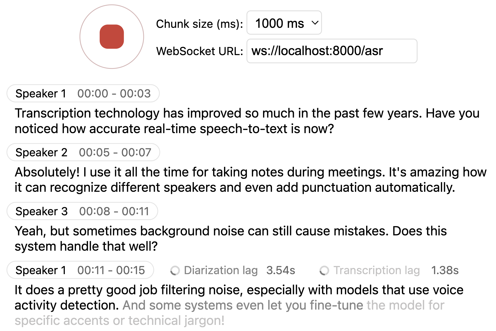

# Real-time, Fully Local Speech-to-Text and Speaker Diarization

This project is based on [Whisper Streaming](https://github.com/ufal/whisper_streaming) and lets you transcribe audio directly from your browser. Simply launch the local server and grant microphone access. Everything runs locally on your machine ✨

<p align="center">
  
</p>

### Differences from [Whisper Streaming](https://github.com/ufal/whisper_streaming)

#### ⚙️ **Core Improvements**  
- **Buffering Preview** – Displays unvalidated transcription segments
- **Multi-User Support** – Handles multiple users simultaneously by decoupling backend and online asr
- **MLX Whisper Backend** – Optimized for Apple Silicon for faster local processing.  
- **Confidence validation** – Immediately validate high-confidence tokens for faster inference

#### 🎙️ **Speaker Identification**  
- **Real-Time Diarization** – Identify different speakers in real time using [Diart](https://github.com/juanmc2005/diart)

#### 🌐 **Web & API**  
- **Built-in Web UI** – Simple raw html browser interface with no frontend setup required
- **FastAPI WebSocket Server** – Real-time speech-to-text processing with async FFmpeg streaming.  
- **JavaScript Client** – Ready-to-use MediaRecorder implementation for seamless client-side integration.


## Installation

1. **Clone the Repository**:

   ```bash
   git clone https://github.com/QuentinFuxa/whisper_streaming_web
   cd whisper_streaming_web
   ```


### How to Launch the Server

1. **Dependencies**:

- Install required dependences :

    ```bash
    # Whisper streaming required dependencies
    pip install librosa soundfile

    # Whisper streaming web required dependencies
    pip install fastapi ffmpeg-python
    ```
- Install at least one whisper backend among:

    ```
   whisper
   whisper-timestamped
   faster-whisper (faster backend on NVIDIA GPU)
   mlx-whisper (faster backend on Apple Silicon)
   ```
- Optionnal dependencies

    ```
    # If you want to use VAC (Voice Activity Controller). Useful for preventing hallucinations
    torch
   
    # If you choose sentences as buffer trimming strategy
    mosestokenizer
    wtpsplit
    tokenize_uk # If you work with Ukrainian text

    # If you want to run the server using uvicorn (recommended)
    uvicorn

    # If you want to use diarization
    diart
    ```

    Diart uses by default [pyannote.audio](https://github.com/pyannote/pyannote-audio) models from the _huggingface hub_. To use them, please follow the steps described [here](https://github.com/juanmc2005/diart?tab=readme-ov-file#get-access-to--pyannote-models).


3. **Run the FastAPI Server**:

    ```bash
    python whisper_fastapi_online_server.py --host 0.0.0.0 --port 8000
    ```

    **Parameters**
   
    All [Whisper Streaming](https://github.com/ufal/whisper_streaming) parameters are supported.  
    Additional parameters:
    - `--host` and `--port` let you specify the server’s IP/port. 
    - `-min-chunk-size` sets the minimum chunk size for audio processing. Make sure this value aligns with the chunk size selected in the frontend. If not aligned, the system will work but may unnecessarily over-process audio data.
    - `--transcription`: Enable/disable transcription (default: True)
    - `--diarization`: Enable/disable speaker diarization (default: False)
    - `--confidence-validation`: Use confidence scores for faster validation. Transcription will be faster but punctuation might be less accurate (default: True)

5. **Open the Provided HTML**:

    - By default, the server root endpoint `/` serves a simple `live_transcription.html` page.  
    - Open your browser at `http://localhost:8000` (or replace `localhost` and `8000` with whatever you specified).  
    - The page uses vanilla JavaScript and the WebSocket API to capture your microphone and stream audio to the server in real time.

### How the Live Interface Works

- Once you **allow microphone access**, the page records small chunks of audio using the **MediaRecorder** API in **webm/opus** format.  
- These chunks are sent over a **WebSocket** to the FastAPI endpoint at `/asr`.  
- The Python server decodes `.webm` chunks on the fly using **FFmpeg** and streams them into the **whisper streaming** implementation for transcription.  
- **Partial transcription** appears as soon as enough audio is processed. The “unvalidated” text is shown in **lighter or grey color** (i.e., an ‘aperçu’) to indicate it’s still buffered partial output. Once Whisper finalizes that segment, it’s displayed in normal text.  
- You can watch the transcription update in near real time, ideal for demos, prototyping, or quick debugging.

### Deploying to a Remote Server

If you want to **deploy** this setup:

1. **Host the FastAPI app** behind a production-grade HTTP(S) server (like **Uvicorn + Nginx** or Docker). If you use HTTPS, use "wss" instead of "ws" in WebSocket URL.
2. The **HTML/JS page** can be served by the same FastAPI app or a separate static host.  
3. Users open the page in **Chrome/Firefox** (any modern browser that supports MediaRecorder + WebSocket).  

No additional front-end libraries or frameworks are required. The WebSocket logic in `live_transcription.html` is minimal enough to adapt for your own custom UI or embed in other pages.

## Acknowledgments

This project builds upon the foundational work of the Whisper Streaming project. We extend our gratitude to the original authors for their contributions.

